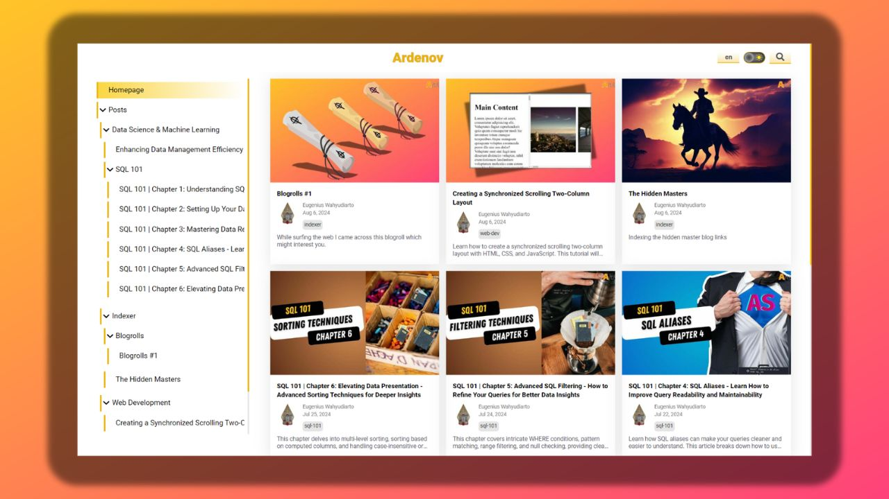

# Ardenov Blog

Welcome to the Ardenov Blog project! This platform is designed with the primary goal of sharing knowledge across various domains in an accessible and user-friendly manner.

## Visit the Site

Explore the site at [https://blog.ardenov.com](https://blog.ardenov.com) or the mirror/archive at [https://eugeniusw.github.io](https://eugeniusw.github.io). 

## Features

### 🌗 Dark/Light Mode Supported
The site supports both dark and light modes, which are initially adjusted based on your system theme. If you manually toggle between dark and light mode on the site, your preference will be saved for future visits.

### 📱 Responsive Design
The site is fully responsive and optimized for mobile, tablet, and desktop viewing.

### 🖼️ Built-in Image Optimization
Images are optimized for data saving, with the ability to load high-resolution versions on demand by clicking on the image.

### 📝 Social Media Thumbnails
Each article has a thumbnail that displays when shared on social media, ensuring your content looks great wherever it's shared.

### 📚 Table of Contents (TOC)
Articles include a TOC for easy navigation through content, making it simpler to jump to specific sections.

### 🔄 Previous/Next Navigation
Articles grouped within the same section feature previous and next navigation links, enhancing the reading flow.

### 💬 User Comments
Users can comment on articles. Comments are only loaded on demand, improving page load speed.

### 📰 RSS Feed
The site includes an RSS feed feature, so you can easily bookmark and stay updated with new articles.

### 🔍 Article Search
Quickly find the articles you're interested in with the built-in search functionality.

### ⚡ Lightweight and Fast
The site is built using vanilla JavaScript with minimal dependencies, compressed CSS classes, and minimized HTML/CSS/JS for optimal performance.

### 🌍 Multi-language Support
Currently, the site supports English and Bahasa Indonesia, allowing for a broader audience reach.

### 💻 Syntax Highlighting
Code snippets are presented with GitHub-flavored syntax highlighting for enhanced readability.

### 🛠️ HTML, CSS, and JS Sandbox Renderer
Inspired by [codepen.io](https://codepen.io/), the site includes a built-in sandbox renderer for HTML, CSS, and JS, enabling users to interact with and test code snippets directly.

## Contributing

Want to publish your own article? Reach out to me on [LinkedIn](https://www.linkedin.com/in/eugeniuswahyudiarto/) and send your article in markdown format. We are always looking for new knowledge to share!
